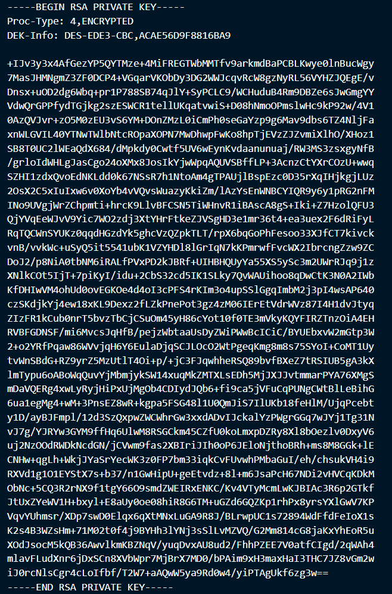
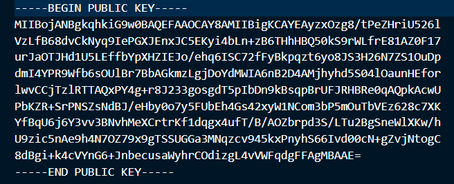

# Laboratorio 4: RSA


## Escenario:
Plataforma de Transferencia de Documentos Legales
Una firma de abogados necesita transferir documentos confidenciales entre sus oficinas de Guatemala
City, Miami y Madrid. Los documentos contienen contratos, acuerdos de confidencialidad y datos
personales.
El sistema debe garantizar:
- Solo el destinatario pueda leer el documento

## Ejercicio 1

1. El sistema usa RSA como mecanismo de intercambio de clave, protegiendo una clave AES que cifra el documento real.

- ¿Explique por qué no cifrar el documento directamente con RSA?

El algoritmo RSA es computacionalmente pesado y necesitamos cifrar documentos con una gran cantidad de bits, si usamos RSA el proceso de cifrado y descifrado sería muy lento, por lo tanto no es buena idea cifrar el documento con RSA directamente. Otra razón par ano cifrar directamente con RSA es que este algoritmo es determinista y un atacante poodría comparar firmas y lograr descifrar el contenidop del documento. 


2. Generación de claves: implementar la generación de claves *RSA* en *python*

La implementación de la generación de llaves se realizó en el archivo [generar_claves.py](src/generar_claves.py). 
Este es el código de la función de python que se utilizó para generar llaves RSA:

```python

def generar_par_claves(bits: int = 3072, 
                       pwd: str= '', 
                       private_route: str = 'keys/private.pem',
                       public_route: str = 'keys/public.pem'
                       ) -> tuple[bytes, bytes]:
    """
    Genera un par de claves para cifrado y descifrado RSA en formato .pem
    Args:
        bits (int): la cantidad de bits de la llave RSA (por defecto 3072)
        pwd (str): passphrase para nuestra llave provada (por defecto vacía)
        private_route (str): la ruta en donde vamos a guardar la llave privada en formato .pem
        public_route (str): la ruta en donde vamos a guardar la llave pública en formato .pem
    Returns:
        private_key (bytes): la llave privada
        public_key (bytes): la llave pública
    """

    key = RSA.generate(bits)
    
    private_key = key.export_key(passphrase = pwd) if pwd != '' else key.export_key()      
    public_key  = key.publickey().export_key()

    with open(private_route, 'wb') as f:
        f.write(private_key)
    with open(public_route, 'wb') as f:
        f.write(public_key)

    print('Clave privada:')
    print(private_key.decode())
    print('\nClave pública:')
    print(public_key.decode())

    return private_key, public_key

```

Esta función genera llaves públicas y privadas en formato .pem. Esta clase de archivos tiene la siguiente estructura:

- Serializa la información de la llave en formato *ASN1*, aquí guarda toda la información necesaria para la llave como los valores de *p* y *q*, el valor de *N*, etc

```bash
RSAPrivateKey ::= SEQUENCE {
      version   Version,
      modulus   INTEGER,  -- n
      publicExponentINTEGER,  -- e
      privateExponent   INTEGER,  -- d
      prime1 INTEGER,  -- p
      prime2 INTEGER,  -- q
      exponent1 INTEGER,  -- d mod (p-1)
      exponent2 INTEGER,  -- d mod (q-1)
      coefficient   INTEGER,  -- (inverse of q) mod p
      otherPrimeInfos   OtherPrimeInfos OPTIONAL
    }
```

- Luego usa el formato DER para codificar el contenido serializado en binario

- Luego de tener la información en binaria, se usa base64 para codificar la información y eso es lo que vemos en el archivo *.pem*.





En las imágenes se puede ver el contenido de las llaves generadas en base 64, vemos que hay encabezados en donde se indica en dónde empieza y finaliza el contenido de la llave. En el encabezado de la llave privada también vemos información extra la cuál nos indica que la llave está cifrada con una clave (un *passphrase*) y que algoritmo se usó para cifrar la llave RSA con el passphrase. 


## Referencias

1. Chandra, Y. S. (2023, agosto 26). Anatomy of a PEM file. Medium. https://medium.com/@yashschandra/anatomy-of-a-pem-file-727f1690df18

